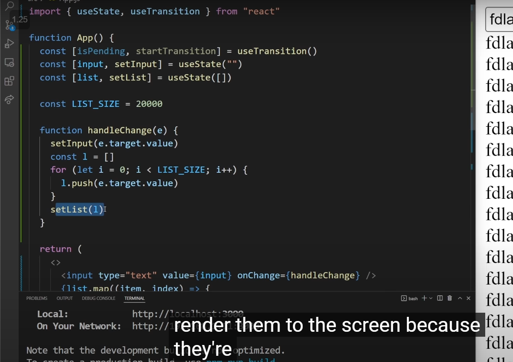
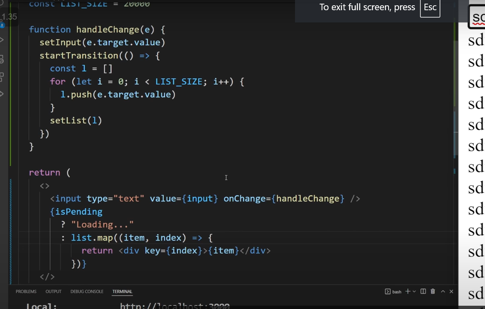

# Getting Started with Create React App

This project was bootstrapped with [Create React App](https://github.com/facebook/create-react-app).

## Available Scripts

In the project directory, you can run:

### `npm start`

Runs the app in the development mode.\
Open [http://localhost:3000](http://localhost:3000) to view it in your browser.

The page will reload when you make changes.\
You may also see any lint errors in the console.

### `npm test`

Launches the test runner in the interactive watch mode.\
See the section about [running tests](https://facebook.github.io/create-react-app/docs/running-tests) for more information.

### `npm run build`

Builds the app for production to the `build` folder.\
It correctly bundles React in production mode and optimizes the build for the best performance.

The build is minified and the filenames include the hashes.\
Your app is ready to be deployed!

See the section about [deployment](https://facebook.github.io/create-react-app/docs/deployment) for more information.

### `npm run eject`

**Note: this is a one-way operation. Once you `eject`, you can't go back!**

If you aren't satisfied with the build tool and configuration choices, you can `eject` at any time. This command will remove the single build dependency from your project.

Instead, it will copy all the configuration files and the transitive dependencies (webpack, Babel, ESLint, etc) right into your project so you have full control over them. All of the commands except `eject` will still work, but they will point to the copied scripts so you can tweak them. At this point you're on your own.

You don't have to ever use `eject`. The curated feature set is suitable for small and middle deployments, and you shouldn't feel obligated to use this feature. However we understand that this tool wouldn't be useful if you couldn't customize it when you are ready for it.

## Learn More

You can learn more in the [Create React App documentation](https://facebook.github.io/create-react-app/docs/getting-started).

To learn React, check out the [React documentation](https://reactjs.org/).

### Code Splitting

This section has moved here: [https://facebook.github.io/create-react-app/docs/code-splitting](https://facebook.github.io/create-react-app/docs/code-splitting)

### Analyzing the Bundle Size

This section has moved here: [https://facebook.github.io/create-react-app/docs/analyzing-the-bundle-size](https://facebook.github.io/create-react-app/docs/analyzing-the-bundle-size)

### Making a Progressive Web App

This section has moved here: [https://facebook.github.io/create-react-app/docs/making-a-progressive-web-app](https://facebook.github.io/create-react-app/docs/making-a-progressive-web-app)

### Advanced Configuration

This section has moved here: [https://facebook.github.io/create-react-app/docs/advanced-configuration](https://facebook.github.io/create-react-app/docs/advanced-configuration)

### Deployment

This section has moved here: [https://facebook.github.io/create-react-app/docs/deployment](https://facebook.github.io/create-react-app/docs/deployment)

### `npm run build` fails to minify

This section has moved here: [https://facebook.github.io/create-react-app/docs/troubleshooting#npm-run-build-fails-to-minify](https://facebook.github.io/create-react-app/docs/troubleshooting#npm-run-build-fails-to-minify)


======================================

useState = state

useEffect = side Effect

useContext = context api

useReducer = reducer

- useReducer is the hook for state management in ReactJS.
- useReducer is primitive hook and useState is build on top of the useReducer hook. 

- Reducer function take two argument (state and action) and return newState from it. where action is action to perform on current state. convention to use switch case statement.

```
// Defining the initial State.
const initialState = 0

// Defining the reducer function.
const reducer = (state, action) =>{
    switch(action){
        case 'increment':
            return state + 1
        case 'decrement':
            return state - 1
        case 'reset':
            return initialState
        default:
            return state
    }
}

// react component
function CounterOne(){
    const [count, dispatch]  = useReducer(reducer,initialState)
}
```

## useLayoutEffect()

when we use useEffect() and after the side effect of page if we want to change the position of any element by using useEffect() it will flash get to correct position so we can see that loading.

but If we use useLayoutEffect() - This hook will update the dom before it render so we can assure that user see on dom is correct as we expected.


============================

## useTransition() hook is best



See the image here `setInput` and `setList` this are the state so it will compute that and then it will render that to the actual DOM.

So there is no priority for that compute this state first and later compute this state.

This problem solved by the `useTransition()` React Hook.



by adding any thing in `startTransition(callback_fn)` so it will set to the low priority and once it successfully compute the it will re-render the component.meanwhile it give us the first argument as boolean so we can show loader something like that.

Cons: 
- it will cause the re-render so use wisely 

Use this hook when performance issue occured in your project.

=================================================

UseEffect()

You can't return the value from `useEffect()` hook and you can't store into variable.

useMemo()

You can return the value of `useMemo()`